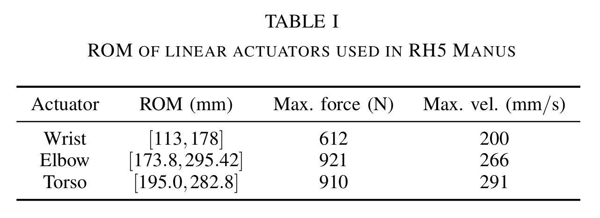

## Introduction
Recent developments in robotics have embraced closed-loop mechanisms in various robots, such as exoskeletons, multi-legged robots, and humanoid robots, due to their advantages in stiffness, payload capacity, and precision. Series-parallel hybrid robots, combining serial chain and parallel mechanisms, aim to mimic human and animal capabilities. While trajectory optimization approaches are powerful for motion planning, series-parallel hybrid robots pose challenges due to their kinematic complexities. Existing solvers for parallel robots suffer from difficulties in modeling and controlling loop closure constraints, making real-time control impractical. This work proposes a case study to address loop-closure constraints within the trajectory optimization process using Pinocchio, a software with proximal formulation of constrained dynamics. The study employs the differential dynamics programming (DDP) approach to generate optimal trajectories for the RH5 Manus humanoid robot, showcasing improved performance over serial abstractions in simulation and real-world experiments. This research is particularly valuable for humanoid robots with electric actuation, seeking human-like agility by pushing the robot to its limits.

## Experimental Design
<figure>
  
  <figcaption>Fig.1 - RH5 Manus Upper Body</figcaption>
</figure>
The experimental design focuses on the RH5 Manus with multiple kinematic loops, used for a weight lifting task through whole body trajectory optimization. The robot comprises 61 spanning tree joints, including 20 independent and 20 active joints, forming a tree abstraction with 10 submechanisms. Among these submechanisms, 5 are serial chain submechanisms, and 5 are closed-loop submechanisms. The closed-loop mechanisms consist of a multi closed-loop torso mechanism , a planar closed-loop elbow mechanism, and a complex multi-loop closure wrist mechanism.

To efficiently handle the complexity of multiple closed-loop mechanisms in a robot, a tree-abstraction is commonly employed. The tree abstraction of the RH5 Manus robot includes only the independent coordinates (green edges) from the topological graph in Fig. 1, resulting in a system with 20 degrees of freedom. Table I and Table II provides the joint limits for the closed-loop mechanisms in actuation space and independent joints space. Choosing conservative torque limits may underestimate the robot's capabilities, while selecting ambitious upper limits would overestimate them.
<figure>
  
  
</figure>

## Results and Discussion
The results are compiled in the follwing video for better understanding.

<video src="video/IROS_2023_weightlifting_final.mp4" controls="controls" style="max-width: 48em;"> </video>

To summarise the work,
<ul>
  <li>The constrained full model improved payload capabilities and better exploited the robot's workspace compared to the tree-like abstraction models.</li>
  <li>The paper demonstrated that incorporating closed loop kinematics constraints in trajectory optimization leads to better trajectories for series-parallel hybrid robots.</li>
  <li>Tuning the constrained optimization problem requires careful selection of proximal parameter values, which can be time-consuming.</li>
  <li>Solving a constrained optimization problem takes more time, making real-time stabilization with loop-closure currently impossible.</li>
  <li>A possible solution for online trajectory optimization while respecting robot capabilities is a bi-level optimization approach with different time horizons for loop-closures and cost model minimization. Explicit formulation of loop-closures could address numerical and computational efficiency issues in the optimization process.</li>
</ul>  
